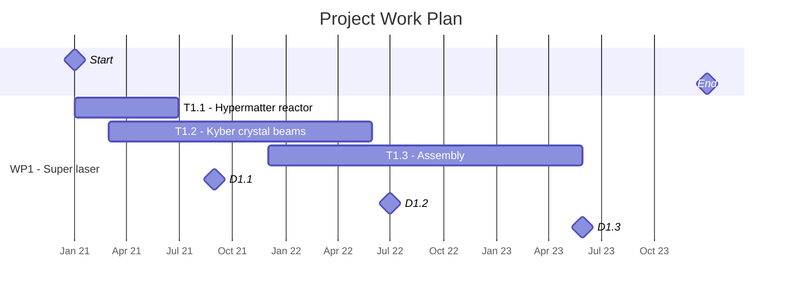

Tags: #project

---

# Death star (DS-1)

Start date: 
End date:
Website:
Proposal:

Topics:
- 

## Timeline

## Motivation

- 

## Currently working on

- 

## Links

- [[Death star Project Meetings]]

## Description of Work

### Work packages

- 

### Deliverables

- 
