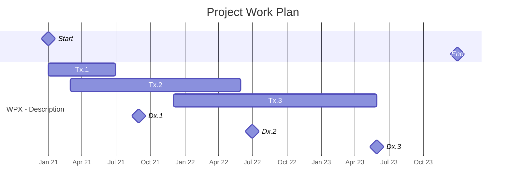

---
aliases:
- 
tags:
- 
---

Tags: #project

# Project title (Acronym)

Start date:
End date:
Website:
Proposal:

Topics:
- 

## Timeline

## Motivation

- 

## Description of Work

### Work packages

- 

### Deliverables

- 

## Currently working on

- 

## Links

- [[{{title}} Project Meetings]]