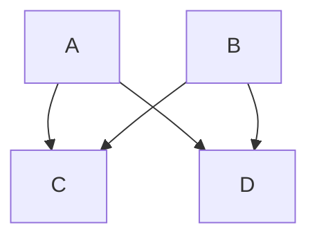

## Markdown Basics

- Obsidian uses markdown, so getting familiar with its syntax would be a good first step
- There are many markdown variations. Obsidian's syntax is based on commonmark. Here are two good places to start:
	- [Markdown Reference](https://commonmark.org/help/)
	- [Markdown Tutorial - Introduction](https://commonmark.org/help/tutorial/index.html)
- The full syntax is described here: [Format your notes - Obsidian Help](https://help.obsidian.md/How+to/Format+your+notes)

### Custom markdown syntax

- Links use the `[[wikilink]]` format, but you can switch to markdown links in the settings if you want. 
	- `[[wikilink#]]` to link to headers
	- `[[wikilink#^]]` to link to individual "blocks"
- You can use a `|` to modify the text being displayed, e.g. `[[wikilink|display text]]`.
- Adding `!` before a link, e.g. `![[wikilink]]` will embed the file, but you can also embed headers (anything starting with `#`) or blocks (using `^`).
	- `![[wikilink]]` for the full note
	- `![[wikilink#Header]]` for headers
	- `![[wikilink#^blockid]]` for individual "blocks"
- It recognizes tags, e.g. #tutorial and clicking on them will open a search
- You can add highlights by surrounding text with `==`, e.g. `==highlight==`, and strikethrough with `~~`, e.g.`~~strikethrough~~`
- It supports [MathJax](https://www.mathjax.org/) to write formulas/equations: `$x^2 + y^2 = z^2$` looks like $x^2 + y^2 = z^2$
- Text enclosed in `%%` are considered comments and won't be rendered `%% Comments %%`

#### Callouts

Callouts were recently added to highlight information, e.g. 

```markdown
> [!info] Callout title
> Content of callout
```

results in: 

> [!info] Callout title
> Content of the callout

#### Mermaid diagrams

Supports rendering [mermaid](https://mermaid-js.github.io/mermaid/#/) diagrams, e.g. 

````markdown

````

results in:


